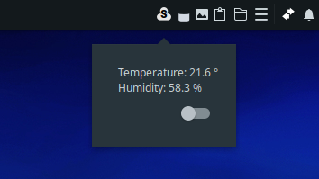
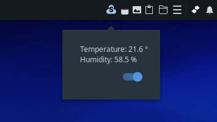

# budgie-sensibo-monitor - WIP

   ### Information
   My first python and Gtk programming project, this should be written a lot better, I am currently stuck, so anyone willing to help clean up the code and implement a better way for global settings would be greatly appreciate.
   
   ### Screen Shots
 


   ### Installl
  ```bash
   $ cd budgie-sensibo-monitor
   $ mkdir build && cd build
   $ meson --buildtype plain --prefix=/usr --libdir=/usr/lib
   $ sudo ninja install
  ```

   ### Uninstall
  ```bash
   $ sudo ninja uninstall
  ```
